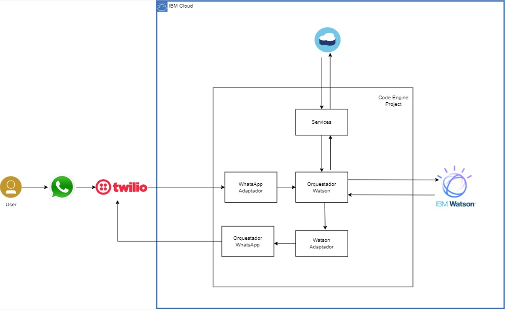

# Proyecto Chatbot para Organización de Eventos

## Descripción

Este proyecto se realizó para crear un chatbot para una organización ficticia que programa eventos de diferente índole. El objetivo fue la integración de este chatbot en distintos canales tales como WhatsApp y Telegram, facilitando la interacción y mejorando la experiencia del usuario.

## Características

- **Multicanal:** El chatbot está disponible en WhatsApp y Telegram.
- **Interacción Dinámica:** Responde en tiempo real a las consultas de los usuarios.
- **Gestión de Eventos:** Permite a los usuarios obtener información sobre eventos, registrarse y recibir notificaciones.

## Tecnologías Utilizadas

- **Node.js:** Plataforma de desarrollo backend.
- **Dialogflow:** Procesamiento de lenguaje natural.
- **Twilio API:** Integración con WhatsApp.
- **Telegram Bot API:** Integración con Telegram.
- **Cloudant:** Base de datos para almacenamiento de datos de usuarios y eventos.

## Arquitectura WhatsApp

## Arquitectura Telegram

